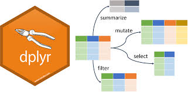
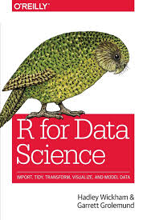

<style>

.bottom {
  margin: 0;
  position: absolute;
  top: 80%;
  left: 50%;
  -ms-transform: translate(-50%, -50%);
  transform: translate(-50%, -50%);
}

@media print {
  .has-continuation {
    display: block !important;
  }
}

.large { font-size: 130% }
</style>

```{r setup, include=FALSE}
options(htmltools.dir.version = FALSE)
knitr::opts_chunk$set(cache = TRUE, fig.align = "center", dev = "svg")
options(tibble.print_max = 6, tibble.print_min = 6)
# knitr::opts_knit$set(root.dir = normalizePath('../'))
```

```{r}
library(tidyr)
library(dplyr)
library(tibble)

```

```{css, echo=FALSE}
pre {
  max-width: 100%;
  overflow-x: scroll;
}
```


# Who is talking ? 

.pull-left[]


.pull-right[]


.center[]

---

# What is data-wrangling ?

--


--

* data-wrangling is the set of operations on __raw__ data that leads to __non messy__ (tidy) data.


---

# What we will talk about today

--

* Data importation

--

* Manipulate data (filtering, arranging data etc.)

--

* Tidy data


--

# What we will NOT talk about today

--

* Dealing with missing values / outliers


---


# Framework

All manipulations will be done in the `tidyverse` framework.


--

Hence, you should, if not already done, run the following command in R __NOW__

```{r, echo = TRUE, eval=FALSE}

install.packages("tidyverse")
```


---

# Tidyverse = Tidy universe

Tidyverse is a set of packages with differents purposes, that share the same syntax and that are designed to work in a complementary way  

--

.center[]


---

You can list the packages available in the `tidyverse` by running the following command:

```{r, echo = TRUE, eval = TRUE}
tidyverse::tidyverse_packages()

```

--

You can see that `ggplot2` that you discovered yesterday belongs to the `tidyverse`. But there are *many other packages* ! 

--

For instance, the `forcats` package allows to work in a convenient way with factors, `lubridate` with dates etc. .

--

For now, we will take a closer look to the `readr` and to a lesser extent `readxl` packages. These packages are useful to __import__ data.


---

# Import data with `readr`

The `read_csv` functon of `readr` allows to read csv files.

--
```{r}

data_work <- readr::read_csv('../data/iris.csv')

```

`read_csv` is faster than base R `read.csv` and it parses well different types of columns.


---

This function has also other arguments that may be useful for you when using it:

--

* `skip` to specify the number of lines to skip before reading the file
* `na` to specify what should be considered as `NA` (for ex: you could put `na = "Not answered"`)
* `col_names` to specify the names of the columns you want to have in your dataset.
* See `?read_csv` for other arguments.

---

# Tibble vs dataframe

Lets take a look at the data we have imported.

```{r}

head(data_work)

```

--

Note the particular output of the print:

* *A tibble*
* The  type of each column is written under each col_name

---

### The tibble is an alternative to the classical `data.frame` of base R

--

As part of the tidyverse, it is mainly used in the tidyverse' packages.

--

__The difference should not worry you__, the main difference with a classical dataframe is the nicer output when printing (run `iris` in R to see the difference). 

--

By the way, note that a tibble __is a data.frame__

```{r}
is.data.frame(data_work)
```


---

## An other package of the `tidyverse` : `readxl` to read .xlsx files

The function `read_xlsx` allows you to read .xlsx files.

--

Some arguments are useful for you:

* `sheet` : name of the sheet of the file you want to read (if you provide a string), or position of the sheet you want to read (if you provide an integer)
* same arguments as `read_csv` (`na`, `skip` etc.)
* see `?read_xlsx` for details.

---

# Exercises


---

## Manipulate your data using `dplyr`

`dplyr` is a package of the `tidyverse` designed to manipulate your data easily.


--

> what do we mean by manipulating the data easily ?


--

Select columns, filter their rows, create new columns etc.

--

.center[]

---

Let us consider the dataset `data_work` previously introduced (it is simply the well know `iris` dataset turned into tibble). 

```{r, echo = FALSE}
data_work
```

Let's consider the manipulations we can do on this dataset.

---

## `dplyr::select`

In a data analysis, we could be interested in:

* *select* some columns, for instance:
  + *select* the 3rd column

--

```{r}
select(data_work, 3)
```


---

## `dplyr::select`

In a data analysis, we could be interested in:

* *select* some columns, for instance:
  + *select* column Sepal.Width

--

```{r}
select(data_work, Sepal.Width)
# Note the absence of " around Sepal .Width
```

---

## `dplyr::select`

In a data analysis, we could be interested in:

* *select* some columns, for instance:
  + *select*  all columns except Sepal.width and Sepal.Length)
  
--

```{r}
select(data_work, - c(Sepal.Width, Sepal.Length))
#Note the absence of " around Sepal.Width and Sepal.Length,
#and the - that means except
```

---

## `dplyr::select`: helpers()

`select()` is provided with many *functions helpers* that you can use to select columns, for instance:

* `select(data_work, contains("pal"))`: all columns of `data_work` containing "pal"

--

* `select(data_work, starts_with("Se"))`: *can you guess it ?*

--

* `select(data_work, ends_with("th"))`: *can you guess it ?*

--

* `select(data_work, matches("*th"))`: *can you guess it ?* (select columns with name matching a regular expression)

--

> That's one of the assets of the dplyr syntax: it looks like almost natural language.

---
  
## `dplyr::filter`

In a data analysis, we could be interested in:

* *filter* rows based on the values of some columns (predicates), for instance:
  + *filter* rows of `data_work` with individuals having their length of Sepal greater than 4

--
```{r}
filter(data_work, Sepal.Length > 4)
```

---


## `dplyr::filter`

In a data analysis, we could be interested in:

* *filter* rows based on the values of some columns (predicates), for instance:
  + *filter* rows of `data_work` of species "virginica"

--

```{r}
filter(data_work, Species == "virginica")
```


---

## `dplyr::filter`
  
You can put multiple conditions, for instance:

* *filter* rows based on the values of some columns (predicates), for instance:
  + *filter* rows of `data_work` of species "virginica" and with their Width of Petal smaller than 2

--

```{r}
filter(data_work, Species == "virginica", Petal.Width < 2)
```

---

> .large[Again, it looks like the natural language !]

--

.large[That's one of the nicer things in the `dplyr` syntax.]

---

## `dplyr::mutate`

--

`mutate` is the verb used to create new columns.

--

For instance, suppose we want to compute the sum of the lengths of the Sepal and the Petal in our dataset.

--

```{r}
mutate(data_work, sum_lengths = Sepal.Length + Petal.Length)
```

---

## `dplyr`: other useful functions

--

`dplyr` provides many useful functions. You can guess their purposes just by their name:

* `arrange`
* `distinct`
* `rename`


---

# Chain commands using %>% (pipe) operator

The %>% (pronounce pipe) provides a convenient way to code, as it allows the code to be written in chain. 

.center[]

---

For instance, suppose we want to:

1. *filter* rows of `data_work` of species "virginica" and with their Width of Petal smaller than 2
2. *then* compute the sum of the lengths of the Sepal and the Petal in our dataset.
3. *then* select the columns with their name starting with an $S$
4. *then* arrange the result by length of Sepal.Length

We would write

--

```{r, eval = FALSE}
arrange(select(mutate(filter(data_work, Species == 'virginica', Petal.Width <2), Sum_lengths = Sepal.Length + Petal.Length), starts_with("S")), Sepal.Length)
```

--

> Isn't it unreadable ?!

---

Let's write it using the %>% operator:

--

```{r,  eval=FALSE}
data_work %>% 
  filter(Species == 'virginica', Petal.Width < 2) %>% 
  mutate(Sum_lengths = Sepal.Length + Petal.Length) %>% 
  select(starts_with("S")) %>% 
  arrange(Sepal.Length)
```


--


See how clearer it looks. 

If I run this: `x %>% sum` it is strictly equivalent to `sum(x)`.

---

Another example to see the power of %>%. Suppose I want to carry out the following steps:

1. Take `data_work`
2. Select variables containing "Sepal", and "Petal.Width" and "Species"
3. Filter rows with length of Sepal greater than 5
4. Fit a linear model of Petal.Width vs Sepal.Width + Sepal.Length + Species
5. Print a summary of the model


--

```{r}

data_work %>% #Step 1
  select(contains("Sepal") ,
         Petal.Width, Species) %>% # Step 2
  filter(Sepal.Length >5) %>% # Step 3
  lm(Petal.Width ~ Sepal.Width + Sepal.Length + Species,
     data= .) %>% # Step 4: NOTE THE .
  summary # Step 5

```

---

```{r}

data_work %>% #Step 1
  select(contains("Sepal") ,
         Petal.Width, Species) %>% # Step 2
  filter(Sepal.Length >5) %>% # Step 3
  lm(Petal.Width ~ Sepal.Width + Sepal.Length + Species,
     data= .) %>% # Step 4: NOTE THE .
  summary # Step 5

```

In this example, it is also important to notice the __.__ . When using the pipe, the "." is the object refering to what's before the last %>% .

--

It is important to specify it when the argument that needs the object before the last %>% is not the first argument.That's why we had to specify it in the `lm` function and not in the `select` function.

---

# Group operations

An important features of `dplyr` is its ability to *group* tibbles and compute operations on these *grouped* tibbles.

---

```{r}
data_work_by_species <- data_work %>%
  group_by(Species) 
# Equivalent to data_work_by_species <- group_by(data_work, Species)

data_work_by_species
```

--

Note the `# Groups:   Species [3]`. It means that operations on this dataset will be done for each group.

---

For example, suppose we want to compute the median of the width of the Sepal for each species.

```{r}
data_work_by_species %>%
  mutate(median_sepal_width = median(Sepal.Width)) %>% 
  select(starts_with("S"), median_sepal_width)

```

It's nice, but we may also need to summarise the table, just keep a summary of the Species and the median.

---

`dplyr::summarise`

It is easily done by the function `summarise`

--

```{r}
data_work_by_species %>%
  summarise(median_sepal_width = median(Sepal.Width)) 

```


---

If you want to take out the grouped structure of you tibble, you just have to use the function `ungroup`

```{r}
data_work_by_species %>% ungroup
```


---


Exercises

---

# Tidy data

1. Each variable must have its own column
2. Each observation must have its row
3. Each value must have its own cell


---

```{r, echo = FALSE, eval = TRUE}
library(tibble)
d <-tribble(~ country, ~`2002`, ~	`2007`,
            "Belgium",	10311970,	10392226,
            "France",	59925035,	61083916,
            "Germany",	82350671,	82400996,
            "Italy",	57926999,	58147733,
            "Spain",	40152517,	40448191,
            "Switzerland",	7361757,	7554661)
```

--

For instance, imagine this dataset, giving the population of different countries in 2002 and 2007:

```{r, eval = TRUE}

d %>% head

```

--

* Is this dataset tidy ?

--

This is dataset is __not__ tidy, as the population, which is an observed variable is not in a distinct column (principle 1.). Year is also a variable, so it should have its column to.

---

Instead, we should have:


```{r, echo = FALSE}
d %>% pivot_longer(cols =  c(`2002`, `2007`), names_to = "year", values_to = "population") %>% head
```


---

### Make tidy data

* `tidyr::pivot_longer` is used to make your dataset *longer* (what a surprise ! :O)
* `tidyr::pivot_wider` is used to make your dataset *wider* (what a surprise ! :O)


---

In practice:

```{r}

#d is the dataset with the populations of the countries
data_tidy <- d %>% pivot_longer(cols =  c(`2002`,`2007`))

head(data_tidy)
```

The first argument is the dataset to tidy (which is not necessary to complete because of the %>% ).

The second is the name of the columns to gather.


---

We can also provide another name to the new column.
The columns to gather can also be selected using the select helpers that we've seen previously:

```{r}

#d is the dataset with the populations of the countries
data_tidy <- d %>%
  pivot_longer(cols =  -country, names_to = "Year", values_to = "Population")

head(data_tidy)
```


---

Conversely, `pivot_wider` allows us to come back to the first dataset.

--

```{r}

data_tidy %>% pivot_wider(names_from = Year, values_from = Population)

```


---

# Conclusion

The `tidyverse` provides many tools to work with data. 

--

Many subjects topics have not been presented today:

* manipulate factors using `forcats`
* manipulate dates factors using `lubridate`
* join tables using the `*_join` functions of `dplyr`
* ...

--

.large[Feel free to consult this book (available for free online):]

.center[]

---


<!-- ### `tidyr::pivot_longer` and `tidyr::pivot_wider` -->

